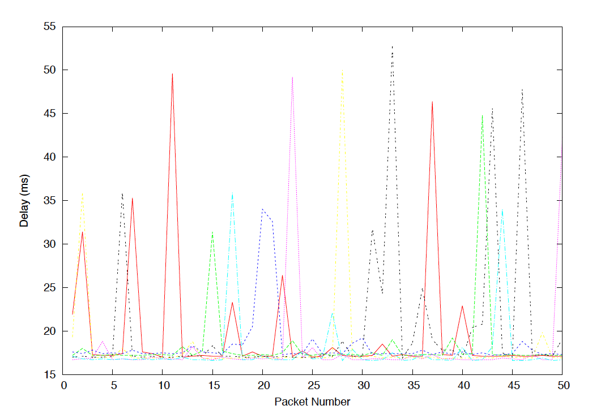
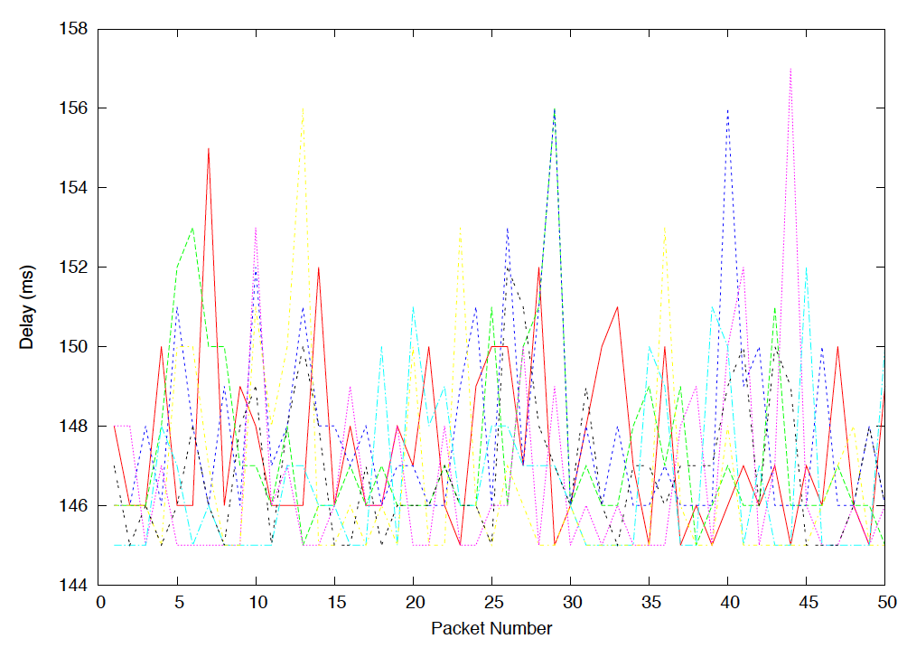

# CS3331 Lab 1: Tools of the Trade

## Exercise 1

### Reachable hosts
* www.cse.unsw.edu.au
* compnet.epfl.ch - `14.3 % packet loss`
* www.intel.com.au
* www.telstra.com.au - `14.3 % packet loss`
* www.amazon.com 
* www.wikileaks.org
* www.tsinghua.edu.cn
* 8.8.8.8

### Unreachable hosts
* www.cancercouncil.org.au - `Request timeout`
* www.hola.hp - `cannot resolve: Unknown host`
* www.kremlin.ru - `Request timeout`

`www.cancercouncil.org.au` is not reachable via a browser or ping and appears to simply time out because it takes too long to wait for a reply from the host.

`www.hola.hp` is not reachable via a browser or ping and returns an unknown host error most likely because the host is down and a route doesn't exist for the destination host.

`www.kremlin.ru` appears to be reachable via a browser but not via ping most likely because the website has purposefully turned it off to avoid DoS attacks, otherwise known as the "Ping of death" or "Ping flood" in which an attacker overwhelms a network with excess ping packets which if successful consumes both outgoing and incoming bandwidth leading to network downtime.

## Exercise 2

### Question 1
#### Traceroute output
```
traceroute to www.nyu.edu (216.165.47.12), 30 hops max, 60 byte packets
 1  cserouter1-server.cse.unsw.EDU.AU (129.94.242.251)  0.383 ms  0.370 ms  0.358 ms
 2  129.94.39.17 (129.94.39.17)  1.264 ms  1.240 ms  1.255 ms
 3  libudnex1-vl-3154.gw.unsw.edu.au (149.171.253.34)  8.239 ms ombudnex1-vl-3154.gw.unsw.edu.au (149.171.253.35)  1.892 ms  1.874 ms
 4  libcr1-po-5.gw.unsw.edu.au (149.171.255.165)  1.433 ms ombcr1-po-5.gw.unsw.edu.au (149.171.255.197)  43.468 ms ombcr1-po-6.gw.unsw.edu.au (149.171.255.169)  43.403 ms
 5  unswbr1-te-1-9.gw.unsw.edu.au (149.171.255.101)  1.431 ms unswbr1-te-2-13.gw.unsw.edu.au (149.171.255.105)  1.497 ms unswbr1-te-1-9.gw.unsw.edu.au (149.171.255.101)  1.453 ms
 6  138.44.5.0 (138.44.5.0)  1.555 ms  1.391 ms  1.431 ms
 7  et-1-3-0.pe1.sxt.bkvl.nsw.aarnet.net.au (113.197.15.149)  2.122 ms  4.068 ms  4.058 ms
 8  et-0-0-0.pe1.a.hnl.aarnet.net.au (113.197.15.99)  96.909 ms  96.892 ms  96.883 ms
 9  et-2-1-0.bdr1.a.sea.aarnet.net.au (113.197.15.201)  147.976 ms  148.043 ms  147.933 ms
10  abilene-1-lo-jmb-706.sttlwa.pacificwave.net (207.231.240.8)  148.027 ms  148.023 ms  148.008 ms
11  et-4-0-0.4079.sdn-sw.miss2.net.internet2.edu (162.252.70.0)  158.735 ms  159.074 ms  157.868 ms
12  et-4-0-0.4079.sdn-sw.minn.net.internet2.edu (162.252.70.58)  180.348 ms  180.312 ms  180.407 ms
13  et-7-0-0.4079.sdn-sw.eqch.net.internet2.edu (162.252.70.106)  188.062 ms  188.126 ms  188.160 ms
14  et-4-1-0.4079.rtsw.clev.net.internet2.edu (162.252.70.112)  196.808 ms  196.921 ms  197.151 ms
15  buf-9208-I2-CLEV.nysernet.net (199.109.11.33)  201.168 ms  201.139 ms  201.140 ms
16  syr-9208-buf-9208.nysernet.net (199.109.7.193)  205.254 ms  205.171 ms  205.318 ms
17  nyc-9208-syr-9208.nysernet.net (199.109.7.162)  210.123 ms  213.722 ms  213.714 ms
18  199.109.5.6 (199.109.5.6)  210.518 ms  210.608 ms  210.748 ms
19  DMZGWA-PTP-EXTGWA.NET.NYU.EDU (128.122.254.65)  211.111 ms  211.034 ms  211.112 ms
20  NYUGWA-PTP-DMZGWA-NGFW.NET.NYU.EDU (128.122.254.108)  230.657 ms  224.863 ms  224.808 ms
21  NYUFW-OUTSIDE-NGFW.NET.NYU.EDU (128.122.254.116)  211.306 ms  211.199 ms  211.282 ms
22  * * *
23  WSQDCGWA-VL902.NET.NYU.EDU (128.122.1.38)  211.609 ms  211.935 ms  211.858 ms
24  * * *
25  * * *
26  * * *
27  * * *
28  * * *
29  * * *
30  * * *
```
#### Answer
There appears to be 23 routers between my workstation and `www.nyu.edu`. 5 routers along the path are part of the UNSW network. Between routers 11 - `et-4-0-0.4079.sdn-sw.miss2.net.internet2.edu (162.252.70.0)` - and 12 - `et-4-0-0.4079.sdn-sw.minn.net.internet2.edu (162.252.70.58)` - do the packets appear to cross the Pacific Ocean since there appears to be a significantly larger average RTT between these two routers than between the previous routers which have only been about 10 ms difference apart while the RTT between these two routers was ~23 ms.

### Question 2
#### Traceroute output
##### Traceroute to www.ucla.edu
```
traceroute to www.ucla.edu (164.67.228.152), 30 hops max, 60 byte packets
 1  cserouter1-server.cse.unsw.EDU.AU (129.94.242.251)  0.129 ms  0.126 ms  0.171 ms
 2  129.94.39.17 (129.94.39.17)  1.083 ms  1.030 ms  1.230 ms
 3  ombudnex1-vl-3154.gw.unsw.edu.au (149.171.253.35)  1.684 ms libudnex1-vl-3154.gw.unsw.edu.au (149.171.253.34)  3.627 ms ombudnex1-vl-3154.gw.unsw.edu.au (149.171.253.35)  2.609 ms
 4  libcr1-po-5.gw.unsw.edu.au (149.171.255.165)  1.446 ms ombcr1-po-6.gw.unsw.edu.au (149.171.255.169)  1.487 ms ombcr1-po-5.gw.unsw.edu.au (149.171.255.197)  1.426 ms
 5  unswbr1-te-1-9.gw.unsw.edu.au (149.171.255.101)  1.456 ms  1.477 ms  1.492 ms
 6  138.44.5.0 (138.44.5.0)  1.573 ms  1.629 ms  1.612 ms
 7  et-1-3-0.pe1.sxt.bkvl.nsw.aarnet.net.au (113.197.15.149)  2.601 ms  4.037 ms  3.978 ms
 8  et-0-0-0.pe1.a.hnl.aarnet.net.au (113.197.15.99)  95.629 ms  95.621 ms  95.645 ms
 9  et-2-1-0.bdr1.a.sea.aarnet.net.au (113.197.15.201)  146.861 ms  146.813 ms  146.793 ms
10  cenichpr-1-is-jmb-778.snvaca.pacificwave.net (207.231.245.129)  163.551 ms  163.558 ms  163.517 ms
11  hpr-lax-hpr3--svl-hpr3-100ge.cenic.net (137.164.25.73)  172.240 ms  172.359 ms  172.356 ms
12  * * *
13  bd11f1.anderson--cr00f2.csb1.ucla.net (169.232.4.4)  171.953 ms bd11f1.anderson--cr001.anderson.ucla.net (169.232.4.6)  171.508 ms  171.482 ms
14  cr00f1.anderson--dr00f2.csb1.ucla.net (169.232.4.55)  171.363 ms cr00f2.csb1--dr00f2.csb1.ucla.net (169.232.4.53)  171.558 ms  171.550 ms
15  * * *
16  * * *
17  * * *
18  * * *
19  * * *
20  * * *
21  * * *
22  * * *
23  * * *
24  * * *
25  * * *
26  * * *
27  * * *
28  * * *
29  * * *
30  * * *
```
##### Traceroute to www.u-tokyo.ac.jp
```
traceroute to www.u-tokyo.ac.jp (210.152.135.178), 30 hops max, 60 byte packets
 1  cserouter1-server.cse.unsw.EDU.AU (129.94.242.251)  0.379 ms  0.371 ms  0.359 ms
 2  129.94.39.17 (129.94.39.17)  1.246 ms  1.240 ms  1.229 ms
 3  ombudnex1-vl-3154.gw.unsw.edu.au (149.171.253.35)  1.963 ms  1.928 ms libudnex1-vl-3154.gw.unsw.edu.au (149.171.253.34)  1.779 ms
 4  ombcr1-po-5.gw.unsw.edu.au (149.171.255.197)  1.412 ms libcr1-po-6.gw.unsw.edu.au (149.171.255.201)  1.447 ms libcr1-po-5.gw.unsw.edu.au (149.171.255.165)  1.418 ms
 5  unswbr1-te-1-9.gw.unsw.edu.au (149.171.255.101)  1.464 ms  1.485 ms  1.503 ms
 6  138.44.5.0 (138.44.5.0)  1.608 ms  1.435 ms  1.350 ms
 7  et-0-3-0.pe1.bkvl.nsw.aarnet.net.au (113.197.15.147)  3.323 ms  2.125 ms  2.087 ms
 8  ge-4_0_0.bb1.a.pao.aarnet.net.au (202.158.194.177)  156.757 ms  156.850 ms  156.824 ms
 9  paloalto0.iij.net (198.32.176.24)  158.627 ms  158.648 ms  158.574 ms
10  osk004bb01.IIJ.Net (58.138.88.189)  271.904 ms  271.972 ms  271.930 ms
11  osk004ix51.IIJ.Net (58.138.106.126)  290.736 ms  290.715 ms osk004ix51.IIJ.Net (58.138.106.130)  281.087 ms
12  210.130.135.130 (210.130.135.130)  322.247 ms  321.291 ms  321.286 ms
13  124.83.228.93 (124.83.228.93)  290.519 ms  283.366 ms  309.060 ms
14  124.83.228.74 (124.83.228.74)  271.650 ms  271.815 ms  281.254 ms
15  124.83.252.242 (124.83.252.242)  288.793 ms  288.814 ms  288.831 ms
16  158.205.134.22 (158.205.134.22)  279.214 ms  279.172 ms  279.223 ms
17  * * *
18  * * *
19  * * *
20  * * *
21  * * *
22  * * *
23  * * *
24  * * *
25  * * *
26  * * *
27  * * *
28  * * *
29  * * *
30  * * *
```
##### Traceroute to www.lancaster.ac.uk
```
traceroute to www.lancaster.ac.uk (148.88.2.80), 30 hops max, 60 byte packets
 1  cserouter1-server.cse.unsw.EDU.AU (129.94.242.251)  0.380 ms  0.375 ms  0.363 ms
 2  129.94.39.17 (129.94.39.17)  1.330 ms  1.302 ms  1.280 ms
 3  libudnex1-vl-3154.gw.unsw.edu.au (149.171.253.34)  1.641 ms ombudnex1-vl-3154.gw.unsw.edu.au (149.171.253.35)  1.761 ms  1.993 ms
 4  ombcr1-po-5.gw.unsw.edu.au (149.171.255.197)  1.522 ms ombcr1-po-6.gw.unsw.edu.au (149.171.255.169)  1.553 ms ombcr1-po-5.gw.unsw.edu.au (149.171.255.197)  1.556 ms
 5  unswbr1-te-1-9.gw.unsw.edu.au (149.171.255.101)  1.585 ms  1.527 ms  1.584 ms
 6  138.44.5.0 (138.44.5.0)  1.641 ms  1.442 ms  1.447 ms
 7  et-1-3-0.pe1.sxt.bkvl.nsw.aarnet.net.au (113.197.15.149)  2.340 ms  2.493 ms  2.483 ms
 8  et-0-0-0.pe1.a.hnl.aarnet.net.au (113.197.15.99)  95.245 ms  95.469 ms  95.408 ms
 9  et-2-1-0.bdr1.a.sea.aarnet.net.au (113.197.15.201)  146.719 ms  146.680 ms  146.659 ms
10  abilene-1-lo-jmb-706.sttlwa.pacificwave.net (207.231.240.8)  147.343 ms  147.311 ms  147.350 ms
11  et-4-0-0.4079.sdn-sw.miss2.net.internet2.edu (162.252.70.0)  157.512 ms  157.509 ms  157.636 ms
12  et-4-0-0.4079.sdn-sw.minn.net.internet2.edu (162.252.70.58)  180.860 ms  180.704 ms  180.644 ms
13  et-7-0-0.4079.sdn-sw.eqch.net.internet2.edu (162.252.70.106)  189.741 ms  188.456 ms  199.316 ms
14  et-4-1-0.4079.rtsw.clev.net.internet2.edu (162.252.70.112)  197.009 ms  197.165 ms  197.155 ms
15  et-2-0-0.4079.sdn-sw.ashb.net.internet2.edu (162.252.70.54)  204.675 ms  204.635 ms  204.549 ms
16  et-4-1-0.4079.rtsw.wash.net.internet2.edu (162.252.70.65)  204.776 ms  204.955 ms  204.925 ms
17  internet2.mx1.lon.uk.geant.net (62.40.124.44)  279.595 ms  279.615 ms  279.607 ms
18  janet-gw.mx1.lon.uk.geant.net (62.40.124.198)  279.774 ms  279.648 ms  279.649 ms
19  ae29.londpg-sbr2.ja.net (146.97.33.2)  285.777 ms  285.776 ms  285.760 ms
20  ae31.erdiss-sbr2.ja.net (146.97.33.22)  284.152 ms  284.144 ms  284.118 ms
21  ae29.manckh-sbr1.ja.net (146.97.33.42)  285.781 ms  285.791 ms  285.842 ms
22  cnl.manckh-sbr1.ja.net (146.97.41.54)  288.149 ms  288.042 ms  288.495 ms
23  * * *
24  ismx-issrx.rtr.lancs.ac.uk (148.88.255.17)  289.874 ms  289.473 ms  289.792 ms
25  dc.iss.srv.rtrcloud.lancs.ac.uk (148.88.253.3)  310.623 ms  307.690 ms  307.699 ms
26  www-ha.lancs.ac.uk (148.88.2.80)  289.755 ms !X  289.523 ms !X  289.294 ms !X
```

#### Answer
The path of my machine to these three destinations seem to diverge at a router with the IP address `138.44.5.0`. Upon running the `whois` command on this router, this router appears to be called AARNET which stands for the Australian Academic and Research Network. The number of hops along each path also appears to be proportional to the physical distance from my computer to the destination, that is, the greater the distance, the more hops it takes to reach the destination. For example the first destination is bound for LA, ~12087 km away from Sydney. The second destination is bound for somewhere in Japan, ~7915 km away from Sydney. The third destination is bound for Lancaster in the UK, ~17008 km away.


Destination | Approximate distance from my computer | Hops taken to reach destination
------------ | ------------- | ------------
1 | 12087 km  | 14
2 | 7915 km | 16
3 | 17008 km | 26

### Question 3

#### Traceroute output

##### Forward path: From my machine to www.speedtest.com.sg
```
traceroute to www.speedtest.com.sg (202.150.221.170), 30 hops max, 60 byte packets
 1  cserouter1-server.cse.unsw.EDU.AU (129.94.242.251)  0.189 ms  0.178 ms  0.167 ms
 2  129.94.39.17 (129.94.39.17)  1.052 ms  1.077 ms  1.069 ms
 3  ombudnex1-vl-3154.gw.unsw.edu.au (149.171.253.35)  1.625 ms libudnex1-vl-3154.gw.unsw.edu.au (149.171.253.34)  1.790 ms  1.520 ms
 4  ombcr1-po-6.gw.unsw.edu.au (149.171.255.169)  1.240 ms ombcr1-po-5.gw.unsw.edu.au (149.171.255.197)  1.309 ms libcr1-po-5.gw.unsw.edu.au (149.171.255.165)  1.196 ms
 5  unswbr1-te-2-13.gw.unsw.edu.au (149.171.255.105)  1.353 ms  1.390 ms unswbr1-te-1-9.gw.unsw.edu.au (149.171.255.101)  1.441 ms
 6  138.44.5.0 (138.44.5.0)  1.419 ms  1.389 ms  1.394 ms
 7  et-0-3-0.pe1.alxd.nsw.aarnet.net.au (113.197.15.153)  1.709 ms  1.794 ms  1.796 ms
 8  xe-0-0-3.pe1.wnpa.akl.aarnet.net.au (113.197.15.67)  24.261 ms xe-0-2-1-204.pe1.wnpa.alxd.aarnet.net.au (113.197.15.183)  24.285 ms xe-0-0-3.pe1.wnpa.akl.aarnet.net.au (113.197.15.67)  24.216 ms
 9  et-0-1-0.200.pe1.tkpa.akl.aarnet.net.au (113.197.15.69)  24.595 ms  24.496 ms  24.536 ms
10  xe-0-2-6.bdr1.a.lax.aarnet.net.au (202.158.194.173)  147.995 ms  147.986 ms  147.963 ms
11  singtel.as7473.any2ix.coresite.com (206.72.210.63)  309.517 ms  309.410 ms  309.446 ms
12  203.208.171.117 (203.208.171.117)  310.748 ms 203.208.172.173 (203.208.172.173)  305.897 ms 203.208.158.29 (203.208.158.29)  328.607 ms
13  203.208.154.45 (203.208.154.45)  331.657 ms 203.208.182.125 (203.208.182.125)  358.598 ms 203.208.173.73 (203.208.173.73)  363.128 ms
14  203.208.171.198 (203.208.171.198)  338.623 ms 203.208.182.45 (203.208.182.45)  327.320 ms 203.208.171.198 (203.208.171.198)  338.630 ms
15  203.208.177.110 (203.208.177.110)  334.582 ms  322.519 ms  336.447 ms
16  202-150-221-170.rev.ne.com.sg (202.150.221.170)  328.271 ms  337.710 ms  328.535 ms
```
##### Reverse path: From www.speedtest.com.sg back to my machine
```
 1  ge2-8.r01.sin01.ne.com.sg (202.150.221.169)  0.309 ms  0.335 ms  0.380 ms
 2  10.12.0.101 (10.12.0.101)  38.259 ms  38.289 ms  38.298 ms
 3  hutchcity3-10g.hkix.net (123.255.90.140)  39.830 ms  39.844 ms  39.852 ms
 4  d1-10-238-143-118-on-nets.com (118.143.238.10)  39.766 ms d1-42-238-143-118-on-nets.com (118.143.238.42)  39.744 ms  39.717 ms
 5  d1-26-224-143-118-on-nets.com (118.143.224.26)  194.577 ms  194.548 ms d1-10-224-143-118-on-nets.com (118.143.224.10)  203.306 ms
 6  aarnet.as7575.any2ix.coresite.com (206.72.210.64)  174.594 ms  181.709 ms  173.296 ms
 7  xe-0-0-3.pe1.tkpa.akl.aarnet.net.au (202.158.194.172)  309.155 ms  317.949 ms  317.924 ms
 8  et-0-1-0.200.pe1.wnpa.akl.aarnet.net.au (113.197.15.68)  298.867 ms  299.803 ms  298.724 ms
 9  xe-0-2-2-204.pe1.alxd.nsw.aarnet.net.au (113.197.15.182)  337.887 ms xe-1-2-1.pe1.msct.nsw.aarnet.net.au (113.197.15.66)  328.745 ms xe-0-2-2-204.pe1.alxd.nsw.aarnet.net.au (113.197.15.182)  338.254 ms
10  et-8-1-0.pe1.brwy.nsw.aarnet.net.au (113.197.15.152)  337.503 ms  337.447 ms  337.896 ms
11  138.44.5.1 (138.44.5.1)  320.277 ms  321.381 ms  328.878 ms
12  ombcr1-te-1-5.gw.unsw.edu.au (149.171.255.106)  342.282 ms  333.984 ms  342.219 ms
13  libudnex1-po-2.gw.unsw.edu.au (149.171.255.198)  341.112 ms  341.393 ms  342.579 ms
14  ufw1-ae-1-3154.gw.unsw.edu.au (149.171.253.36)  334.660 ms  334.639 ms  343.420 ms
```

##### Forward path: From my machine to www.telstra.net/cgi-bin/trace 
```
1  cserouter1-server.cse.unsw.EDU.AU (129.94.242.251)  0.134 ms  0.122 ms  0.167 ms
 2  129.94.39.17 (129.94.39.17)  1.083 ms  1.086 ms  1.060 ms
 3  ombudnex1-vl-3154.gw.unsw.edu.au (149.171.253.35)  2.173 ms  2.139 ms  2.158 ms
 4  ombcr1-po-6.gw.unsw.edu.au (149.171.255.169)  1.395 ms ombcr1-po-5.gw.unsw.edu.au (149.171.255.197)  1.379 ms ombcr1-po-6.gw.unsw.edu.au (149.171.255.169)  1.429 ms
 5  unswbr1-te-2-13.gw.unsw.edu.au (149.171.255.105)  1.440 ms unswbr1-te-1-9.gw.unsw.edu.au (149.171.255.101)  1.332 ms unswbr1-te-2-13.gw.unsw.edu.au (149.171.255.105)  1.497 ms
 6  138.44.5.0 (138.44.5.0)  1.969 ms  1.407 ms  1.376 ms
 7  et-0-3-0.pe1.alxd.nsw.aarnet.net.au (113.197.15.153)  1.928 ms  1.885 ms  1.915 ms
 8  ae9.bb1.b.syd.aarnet.net.au (113.197.15.65)  2.226 ms  2.283 ms  2.266 ms
 9  gigabitethernet1-1.pe1.b.syd.aarnet.net.au (202.158.202.18)  2.319 ms  2.349 ms  2.714 ms
10  gigabitethernet3-11.ken37.sydney.telstra.net (139.130.0.77)  2.838 ms  2.731 ms  2.714 ms
11  bundle-ether13.ken-core10.sydney.telstra.net (203.50.11.94)  3.615 ms  3.559 ms  2.706 ms
12  bundle-ether12.win-core10.melbourne.telstra.net (203.50.11.123)  16.060 ms  14.340 ms  14.301 ms
13  tengigabitethernet8-1.exi2.melbourne.telstra.net (203.50.80.154)  13.715 ms * *
```

##### Reverse path: From www.telstra.net/cgi-bin/trace to my machine
```
 1  gigabitethernet3-3.exi2.melbourne.telstra.net (203.50.77.53)  0.398 ms  0.223 ms  0.241 ms
 2  bundle-ether3-100.win-core10.melbourne.telstra.net (203.50.80.129)  1.744 ms  1.361 ms  2.243 ms
 3  bundle-ether12.ken-core10.sydney.telstra.net (203.50.11.122)  13.111 ms  12.105 ms  13.237 ms
 4  bundle-ether1.ken-edge901.sydney.telstra.net (203.50.11.95)  11.984 ms  11.857 ms  11.985 ms
 5  aarnet6.lnk.telstra.net (139.130.0.78)  11.737 ms  11.606 ms  11.738 ms
 6  ge-6-0-0.bb1.a.syd.aarnet.net.au (202.158.202.17)  11.736 ms  11.733 ms  11.738 ms
 7  ae9.pe2.brwy.nsw.aarnet.net.au (113.197.15.56)  11.986 ms  12.105 ms  11.988 ms
 8  et-3-1-0.pe1.brwy.nsw.aarnet.net.au (113.197.15.146)  16.233 ms  12.605 ms  12.239 ms
 9  138.44.5.1 (138.44.5.1)  12.360 ms  12.232 ms  12.236 ms
10  ombcr1-te-1-5.gw.unsw.edu.au (149.171.255.106)  12.362 ms  12.356 ms  12.238 ms
11  libudnex1-po-2.gw.unsw.edu.au (149.171.255.198)  12.861 ms  12.731 ms  12.613 ms
12  ufw1-ae-1-3154.gw.unsw.edu.au (149.171.253.36)  12.862 ms  12.855 ms  12.862 ms
```

#### Answer

The reverse path does not appear to go through the same routers as the forward path as can be seen in making a quick comparison of the traceroute output of the forward and reverse path of my local CSE machine to the two servers `www.speedtest.com.sg` and `www.telstra.net/cgi-bin/trace`. However the reverse and the forward path do appear to be hopping through routers with close numerical IP addresses to each other which suggests that might be smaller routers of a larger network - for example on hop 7 on the forward path and hop 8 on the backward path to www.telstra.net/cgi-bin/trace the traceroute appears to be going through close numerical IP addresses of `113.197.15.153` and `113.197.15.146`. This is most likely because these routers are smaller routers that are part of a larger server as these two servers appear to be quite large as well as my local CSE server being also part of a larger server hence while they don't go through exactly the same routers getting there they will go through routers with similar numerical IP addresses.

## Exercise 3 

### www.uq.edu.au
#### Delay vs Time

#### Delay vs. Packet Size

#### Packet sizes and average and minimum delay times

Packet size (bytes) | Average delay (ms)| Minimum delay (ms)
------------ | ------------- | ------------
50 | 17.741 | 16.611
250 | 18.120 | 16.711
500 | 18.194 | 16.866
750 | 20.339 | 16.970
1000 | 19.674 | 17.061
1250 | 18.304 | 17.217
1500 | 18.368 | 17.297

### www.nus.edu.sg
#### Delay vs. Time

#### Delay vs. Packet Size

#### Packet sizes and average and minimum delay times
Packet size (bytes) | Average delay (ms)| Minimum delay (ms)
------------ | ------------- | ------------
50 | 147.066 | 145.204
250 | 147.120 | 145.372
500 | 147.161 | 145.503
750 | 147.427 | 145.585
1000 | 147.934 | 145.864
1250 | 147.733 | 145.990
1500 | 148.265 | 146.071


### www.tu-berlin.de
#### Delay vs. Time

#### Delay vs. Packet Size

#### Packet sizes and average and minimum delay times
Packet size (bytes) | Average delay (ms)| Minimum delay (ms)
------------ | ------------- | ------------
50 | 303.099| 302.788
250 |303.228| 302.929
500| 303.190 |303.004
750 |303.591| 303.085
1000 |303.483| 303.190
1250 |303.604 |303.272
1500| 303.682 |303.370

### Answer

#### Question 1
Destination | Approximate distance from UNSW (km) | Minimum delay (RTT @ packet size = 50 bytes) / shortest possible time (ratio)
------------| ------------------------------------| ------------------------------------------------------------------------------
UQ 			 | 925 | 16.611 / 3.083 = 5.39
NUS | 6317 | 145.204 / 21.057 = 6.90
TU BERLIN | 16118 | 302.788 / 53.73 = 5.64


Two possible other reasons why the y-axis values plotted might be greater than 2:
* Network traffic and congestion delays
* Transmission delay caused by the limited data rate transmission of different links packets must travel to reach the destination

#### Question 2
The delays to the destination appears to not be constant but varies over time. This is possibly due to the different type of delays that the packets might have encountered at the time they were transmitted such as network congestion and queueing. For `www.nus.edu.sg` and `www.tu-berlin.de`, the packet delays seems to be depend on the size of the packet size (delay is greater the greater the packet size).

#### Question 3

##### Delays that depend on packet size
* Transmission delay
##### Delays that aren't affected by packet size
* Propagation delay
* Queueing delay
* Processing delay