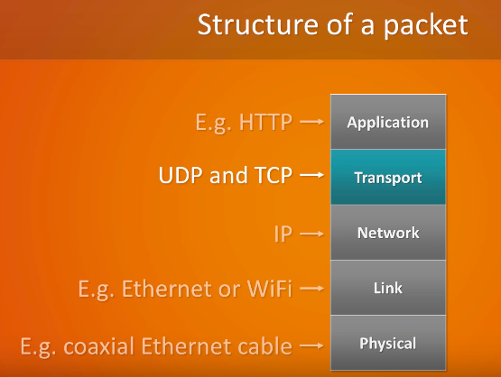

## Units of measurement

Recall time:

* 1 second = 1000 milliseconds (ms)
* 1 millisecond = 1000 microseconds (μs)

Recall bytes:

* Mb = Megabit
* MB = Megabyte
* 1 Mb = 10^6 bits
* 1 Mb = 1000 kilobits (kb)
* 1 kb = 1000 bits
* Nibble = 4 bits
* Byte = 8 bits / 2 nibbles
* 1 Kilobyte (KB) = 1, 024 bytes
* 1 Megabyte (MB) = 1, 024 kilobytes
* 1 Gigabyte (GB) = 1, 024 megabytes
* 1 Terabyte (TB) = 1, 024 gigabytes


## Packet switching

### Statistical multiplexing

Statistical multiplexing is the idea that multiple sessions can share one path.

### Resource pooling

Resource pooling means one session can use multiple paths

## Delay in Packet-Switched Networks

* A packet starts in a host (the source), passes through a series of routers and ends its journey in another host (the destination)

* As the packet travels along this path it suffers from several types of delays at **each** node along the path

### Types of delays

Most important of these delays are:

* processing delay
* queuing delay
* transmission delay
* propagation delay

Together these accumulate to give a total nodal delay.

#### Processing delay

* The time required to examine the packet's header and determine where to direct the packet
* Time needed to check for bit level errors in the packet that occured in transmitting the packet's bits from the upstream node to router A
* In high speed routers typically in microseconds or less
* After processing delay the router directs the packet to the queue that precedes the link to router B

#### Queueing delay

* The time it waits to be transmitted onto the link
* Length of queueing delay depends on how many earlier arriving packets are in the queue and waiting for transmission onto the link
* Typically microseconds to milliseconds in practice

#### Transmission delay

* The amount of time required to push (transmit) all of the packet's bits into the link 
* Typically in microseconds to milliseconds in practice

##### How to calculate

* Denote the length of the packet by `L` bits
* Denote the transmission rate of the link from router A to router B by `R` bits/sec
* Tranmission delay = `L/R`

For example:

```
A 10 Mbps Ethernet link.
R = 10 Mbps for a 100 Mbps Ethernet link. Hence R = 100 Mbps.
L = 1000 bits
Transmission delay = (1000 / (100 * 10^6)) * 1000 = 0.01 ms
```

#### Propagation delay

* Time required to propagate from the beginning of the link to router B AFTER the bit is pushed onto the link (transmitted)
* Bit propagates at the propagation speed of the link 
* Speed depends on the physical medium of the link (e.g. fibre optics, copper wire etc.) which is in the range of `2*10^8 m/s to 3*10^8 m/s` which is equal to or a little less than the speed of light
* Once the last bit of the packet propagates to node B, all the preceding bits of the packet are stored in router B 
* Typically in ms

##### How to calculate

* Distance between 2 routers divided by propagation speed i.e. `d/s` where `d` is the distance between router A and router B and `s` is the propagation speed of the link

#### Propagation delay vs transmission delay

* Transmission = amount of time required for the router to push out the packet onto the link, that is f(packet length, transmission rate of link) but has nothing to do with the DISTANCE between 2 routers
* Propagation = Time it takes a bit to propagate from one router to the next, i.e. f(distance between 2 rouers, propagation speed of link)

#### Total nodal delay


#### End-to-End Delay

Total delay from source to destination


## Protocols

A protocol defines the format and the order of messages sent and received among network entities along with actions taken on message transmission and receipt.

## Protocol layers and their service models

#### A protocol layering model
### Advantages

* Modularity  - easier to update system components

### Disadvantages

* Duplicate lower layer functionality (redundancy)
* Functionality at one layer may need information that it present only in another layer which violates the goal of the separation of layers

### The protocol stack



The following is a top down approach to the stack:

#### Application layer

* Where network applications and their application-layer protocols reside
* The internet's application layers includes many protocols such as the HTTP protocol (Web document request and transfer), SMTP (transfer of email messages) and FTP (transfer of files between 2 end systems)
* DNS is another application layer protocol which translates host names into IP addresses 
* Application layer protocols exchange packets of information called **messages** with the same application in another end system (as they are distributed over multiple end systems) 

#### Transport layer

* Transports application layer messages between application end points
* Two main ones on the internet - TCP and UDP which can transport application-layer messages
* TCP provides a connection oriented service to its application while UDP provides a connectionless service to its applications
* A transport layer packet is a **segment**

##### TCP

* breaks long messages into shorter segments
* provides congestion control so transmission rate is throttled at a source when network becomes congested

##### UDP

* no reliability, no flow control, no congestion control

##### UDP vs TCP

###### UDP Advantages

* small packet sizes:
	* UDP header: 8 bytes
	* TCP header: 20 bytes
* No connection to create and maintain
* More control over when data is sent

###### UDP Disadvantages

* primitive error detection
* 16 bit checksum
* no compensation for lost packets
* packer order doesn't get preserved
* no congestion control - hence less reliable

###### TCP Advantages

* more reliable, connection based via a three way handshake
* delivery acknowledgements 
* retransmission if it doesn't receive a delivery acknowledgment from the client
* in order delivery of packets
* congestion control - delays transmission when the netwrok is congested
* error detection - no improvement on UDP but checksum now mandatory for IPv4 and IPv6

###### TCP Disadvantages
* Bigger header
* Data doesn't always get sent out immediately (effect of congestion control)
* Bigger overhead - retranmission of packets, acknowledgement of packets 

###### Conclusion
* UDP is message oriented
	* Application sends data in distinct chunks
* TCP is stream-oriented
	* Used as a continuous flow of data
	* Split up in chunks by TCP

TCP: file transfers, remote access (e.g. SSH) - when data loss can't be tolerated or in-order delivery is needed and when delivery acknowledgements are needed, also some firewalls block UDP altogether
UDP: Video streaming, small transactions such as DNS lookups - less overhead, send delay is undesirable, data loss can be masked and no need to create and close the connection first and in general more bandwidth intensive that tolerate packet loss

#### Network layer

* Transports network layer packets known as **datagrams** from one host to another
* Transport layer protocol (TCP or UDP) in a source host passes a transport layer segment and a destination address to the network layer, the network layer then delivers the segment to the transport layer in the destination host
* This layer includes the IP protocol which defines the fields in the datagram as well how the end systems and routers act on these fields
* Also includes routing protocols that determine the routes datagrams must take between sources destinations 
* Network layer if often known as the **IP layer** even though it also contains routing protocols - this reflects that IP is the glue that binds the internet together

#### Link layer

* To move a packet from one node to the next node in the route, the network layer relies on the services of the link layer
* Network layer passes the datagram down to the link layer which delivers the datagram to the next node along the route which then passes it back up to the network layer
* Link layer protocols include Ethernet, WiFi
* Link layer packets are called **frames**
* Services in this layer depend on specific link-layer protocols on the link which can include special properties like reliable delivery from one node to the next

#### Physical layer

* Responsible for moving individual bits within the frame (link layer packets) from one node to the next 
* Protocols in this layer depend on the link and also the physical transmission medium (e.g. twisted pair copper wire, single-mode fiber optics)
* Link layer has many physical layer protocols for each type of transmission medium


