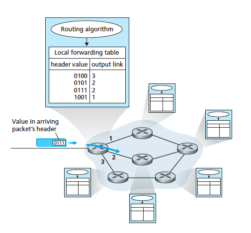
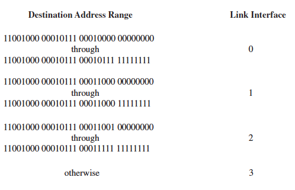
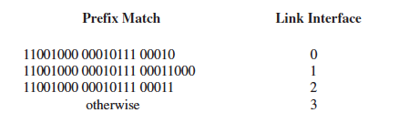
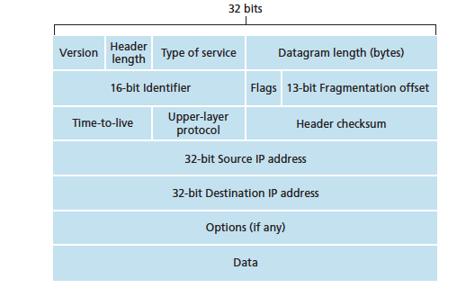
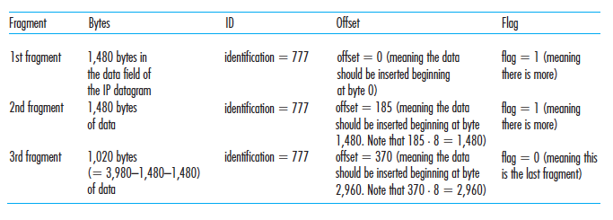
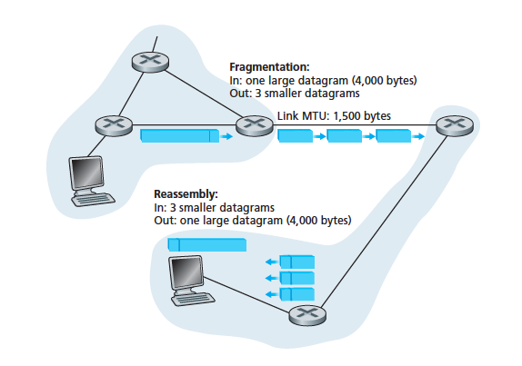
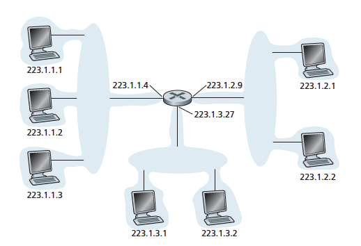

# CH4 Network Layer

* [x] Overview and services it provides

* [x] Structuring network layer packet delivery:
	* [x] Datagram 
	* [x] Virtual circuit model

* [ ] Fundamental role that addressing plays in delivering a packet to its destination host

* [ ] Packet forwarding on the internet 

* [ ] IP 

Network-layer addressing and IPv4 datagram format

* [ ] Network address translation (NAT), datagram fragmentation, Internet Control Message Protocol, IPv6

Three major sections:
1. Network layer functions and services
2. Forwarding
3. Routing 

## Overview

The main role of the network layer is to move packets from a sending host to a receiving host.

To do so, 3 important network layer functions are used:

* Forwarding 
* Routing

### Fowarding

* A router-local action 
* When a packet arrives at a router's input link, the router must move the packet to the appropriate output link i.e. the next router which is on a path to the destination host
* Each router has a forwarding table
* A router forwards a packet by examining the arriving packet's header (usually the destination address of the packet) and then inserting that value as the key and the value as the output link the packet will be forwarded to 

### Routing 

* A network wide process 
* Determines end-to-end paths that packets take from source to destination 
* The routing algorithm determines the values that are inserted into the routers' forwarding tables
* May be centralised (operating from one site and then downloading routing info to each of the routers)
* Or decentralised (a piece of the distributed routing algorithm runs in each router)
* Either way, routers receive routing protocol messages which are used to confgure the forwarding table

### Switches

A `packet switch` means a general packet-switching device that transfers a packet from the input link to the output link according to the value in packet's header field 

* Some packet switches are called `link-layer-switches` which base their forwarding decision a link layer field (layer 2)
* Another type of packet switch is a `router` which bases its forwarding decision on the value in the network layer field (layer 3)

### Connection setup

* In some networks, connection setup is required similarly to TCP in which routers along a chosen path from src to dest must handshake with each other to setup state before network layer data packets can be sent 

### Services offered by the network layer

The `network service model` defines the services offered by the network layer to provide end-to-end transport to packets between two end systems 

The Internet's network layers provides a single service known as `best-effort service` where

* Timing between packest is not guaranteed to be preserved
* Packet receipt order not guaranteed
* Eventual delivery of packet not guaranteed

Alternatives do exist to this best-effort model for example ATM service models 

### Virtual circuit and datagram networks

* Similarly to TCP and UDP in the transport layer, the network layer also provides connectionless or connection service between 2 hosts
* `Virtual circuit networks`  provide a connection oriented service
* `Datagram network` provide a connectionless service 
* These two types use very different info in making their forwarding decisions

#### Virtual circuit networks

* The internet uses VC services to implement a connection based service at the network layer 
* Short are called VCs
 
A VC consists of

1. A path of links and routers between src and dest hosts
2. VC numbers, 1 number for each link along the path
3. Entries in the forwarding table in each router along the path

* A packet belonging to a VC will carry a VC number in its header
* Since a VC may contain a different VC number for each link, at each router, the router must update the VC number of the traversing packet with a new number that is obtained from the forwarding table 

##### Main phases

There are three key phases in a virtual circuit:

###### VC setup

* The sending transport layer contacts the network layer, specifies the receiver's address
* The network layer determines the path between sender and receiver and the VC number for each link along the path
* The network layer then adds an entry in the forwarding table in each router along the path 

###### Data transfer

* Once the VC has been established, packets can begin to flow along the VC

###### VC teardown

* Initiated when the sender or receiver informs the network that it wants to terminate the VC 
* The network layer then informs the other end system of the connection that termination has been called at the other end
* Then the network layer updates the forwarding tables in each of the routers along the path (removing relevant entries) to indicate the VC doesn't exist anymore 

Messages that are passed between routers to setup the VC are known as `signaling messages` and the protols used to exchange them are called `signaling protocols`

#### Datagram networks

* In a datagram network, each time a packet is sent, the packet is stamped with the address of the destination and popped onto the network
* No VC setup and routers don't maintain any VC state information 
* At each router the packet travels through from src to dest the router uses the packet's dest address to forward the packet
* The router does this by looking up the dest address on its forwarding table to get back an appropriate output link inferface to send it to and then forwards the packet using this info 

##### How destination address lookup works at each router

* Suppose all dest addresses are 32 bits 
* Each router has four links numbered 0 - 3 
* Then the forwarding table would capture a range to map where addresses in that range should be sent to what output link like so:

The range is condensed into a prefix match such that the table looks like (looks more simple):

* When the address matches more than one entry in the table the router uses the `longest prefix matching rule` in which it matches the address with the longest prefix match in the table 

##### Comparison with VC networks

* Although datagram networks maintain no connection state info they still maintain forwarding state info in their forwarding tables 
* However forwarding tables are constantly modified by routing algorithms at any time not just at connection setup and teardown like in VCs so a series of packets can follow different paths through the network as forwarding tables are modified 
* This results in packets arriving out or order

#### Origins of VC and datagram networks

* VCs evolved from the original telphone networks which used real circuits
* The internet is a datagram network which grew out of the need to connect computers together in a minimal service model - it is much simpler than VCs but provides less services as a result 
* Instead these services are implemented at the higher transport layer e.g. in order delivery, reliable data transfer etc 

### What's inside a router

*  Recall that the forwarding function is the actual transfer of packets from a router's incoming links to the appropriate outgoing links at that router
*  As mentioned above we looked at two aspects of forwarding - addressing and longest prefix matching 
* Note that `forwarding` and `switching` are used interchangeably 

#### Key components

* There are four key components in a router

##### Input ports 

* Terminates an incoming physical link at a router
* Link layer functions to interoperate with the link layer at incoming link 
* The lookup function for the forwarding table is also performed at the input port  which determines which outgoing port the packet should go to
* Control packets containing routing protocol info are forwarded to the routing proccessor 
* Note that `port` refers to the physical input and output interface on the router itself

##### Switching fabric 

* Connects the router's input ports to its output ports
* Completely contained within the router - a network inside of the router!

##### Output ports

* Stores packets received from teh switching fabric and transmits these packets to the outgoing link by performing the necessary link-layer and physical layer functions

##### Routing processor

* Executes routing protocols
* Maintains routing tables and attached link info
* Computes the forwarding table for the router

A router's input ports, output ports and switching fabric implement the forwarding function and are always implemented in hardware

They're collectively referred to a the `router forwarding plane`

`TODO`

* [ ] Cover more infor about this Page 321 - 331 (actual textbook pages, diff from pdf pages)

## The Internet Protocol (IP): Forwarding and Addressing in the Internet

The internet's network layer has three major components:

* IP protocol 
* Routing - computing the forwarding tables 
* Error and information reporting - Internet Control Message Protocol (ICMP)

### Datagram format

* A datagram is a network layer packet
* Diagram of the fields:

Some key fields:

#### Version number

* 4 bits and specifies protocol version
* Different versions of IP use different datagram formats
* So looking at the vr # the router can determine how to interpret the rest of the datagram

#### Header length

* 4 bits
* Stores how long the header is so where the data actually begins can be easily accessed
* Typically IP has a 20 byte header so the 21st byte is where the header begins

#### Type of service (TOS)

* 4 bits
* TOS allows specification of different types of IP datagrams
* For example, some datagrams require low delay like real-time datagrams 
* Others require more reliability like FTP 

#### Datagram length

* 16 bits long
* Hence max size is 65, 535 bytes 
* Most datagrams are < 1500 bytes
* Total length of the datagram (header + data) 
* In bytes

#### Identifier, flags, fragmentation offset

* Deal with IP fragmentation 

#### Time-to-live (TTL)

* To ensure that datagrmas don't circulate forever (for example, due to a long-lived routing loop)
* This field is decremented by 1 each time the datagram is processed by a router
* When TTL field is 0 the datagram must be dropped

#### Protocol

* This field is used only when the datagram reaches its final dest 
* Value of this field indicates what transport layer protocol the data portion of the datagram should be passed to 
* E.g. A value of 6 = TCP and 17 = UDP 
* List of all possible values are in IANA Protocol Numbers 2012
* Similar to port number field in the transport layer
* Binds the network and transport layer together while the port number is the glue that binds the transport and application layers together 

#### Header checksum

* helps detect bit errors in a received datagram
* Headsum is computed by treating each 2 bytes in the header as a number, summing them using 1s complement arithmetic 
* A router computes the header checksum for each datagram and detects an error condition if the checksum carried in the datagram doesn't equal the computed check sum 
* If there is an error, routers typicallly discard datagrams
* Checksum must be recomputed and stored again at each router
* Only th header is checksummed

#### Source and dest IP address 

* When src reates a datagram, it inserts its IP addr into the source IP addr and sets the dest IP address field (which the source host retrieves from a DNS lookup)

#### Options 

* Allow a IP header to extended
* Meant to be used rarely however it does complicate things as it means datagram headers can be of variable length
* Hence processing times for IP datagrams at routers vary a lot
* Hence in the IPv6 header, IP options were dropped

#### Data

* the payload & most important field
* contains the transport layer (UDP or TCP) segment to be delivered to the dest 

### Typical datagram size 

*  An IP datagram has a total of 20 bytes of header (assuming no options)
* It also carries a TCP segment which contains 20 bytes of header 
* Hence total amount of header in a datagram = 40 (20 in IP and 20 in TCP header) + the data size (application layer message)

### IP datagram fragmentation 

* Not all link layer protocols carry network layer packets of the same size 
* Since some protocols can carry big datagrams whereas some protocols can carry only little packets
* E.g. Ethernet frames can carry max 1500 bytes of data 
* Max amount of data that a link layer frame can carry is called the `maximum transmission unit` (MTU)
* MTU places a hard limit on the length of an IP datagram size since the datagram needs to travel along the link layer frame to get to the next router 

#### Forwading Problem 
* The main problem this presents is for IP datagrams is that different links along the path to the dest have different link layer protocols and hence different MTUs
* For example, if say a datagram is at a router and has to travel to the next outgoing link however that outgoing link is too small what does the router do?

#### Solution - fragments

* Hence the solution to this forwading problem is to fragment the data in the IP datagram into 2 or more smaller IP datagrams when this happens 
* Each of these smaller datagrams is called a `fragment`
* Fragments need to be reassembled before they reach the transport layer at the dest 
* These fragments are then reassembled when they reach the dest host 
* In order for the dest host to figure out how to reassemble these fragments the `identification`, `flag` and `fragmentation offset` fields in the IP datagram are used 
* All fragments that belong to the same original datagram (but got split up along the way) has the same `identification` number in it's header field 
* The last fragment of the original larger datagram has the `flag` bit set to 0 while all other fragments have the `flag` bit set to 1
* The `offset` field is used to specify where the fragment fits within the original datagram 
* For example, a datagram of 4000 bytes (= 20 bytes of header + 3980 of payload) arrives at a router and must be forwarded into a link with an MTU of 1500 bytes
* This implies that we must split up the 3980 data bytes in the datagram into 3 segments 
* Also suppose the datagram has the identification number 777
* The following table shows what these fragments would look like:

* The following diagram shows the entire fragmentation process in the scenario described:

#### IP fragmentation costs

While fragmentation plays an important role in addressing the problem of different link-layer protocols it has its costs including:

* Complicates routers and end systems which need to designed to accomodate datagram fragmentation and reassembly
* Used to create lethal DoS attacks where an attack sends a series of bizzarre and unexpected fragments
* For example the Jolt2 attack, the attacker sends a stream of small fragments to the target host none of which has an offset of 0
* Hence the target collapses as it attempts to rebuild datagrams out of the degenerate packets 
* Another class of exploits sends overlapping IP fragments, that is fragments whose offset values are set so that the fragments don't align properly 
* Vulnerable operating systems, not knowing what to do with the overlapping fragments, can crash as a result 
* IPv6 got rid of fragmentation altogether hence streamlining IP packet processing and making IP less vulnerable to attack 

### IPv4

* IP Protocol version 4
* widely used
* The boundary between a host/router and a physical link is called an `interface`
* A router has multiple interfaces, one for each of its links
* An IP address is technically associated with an interface rather than the host or router containing that interface
* Each IP address is 32 bits long (4 bytes) and thus there is a total of 2^32 possible IP addresses 
* This is equivalent to about 4 billion possible IP addresses 
* Addresses are writted in `dotted-decimal` notation in which each byte is writen in its decimal form and separated with a dot from other bytes. 
* E.g. the IP address 193.32.216.9 - 193 is the decimal equivalent of the first 8 bits of the address and 32 is the decimal equiv of the next 8 bits etc
* Each IP address at each interface on every host and router on the Internet must have a unique IP address 
* One router with three interfaces will have an IP address at each interface which share the leftmost 24 bits in their IP address as seen in the diagram:

* In IP terms this network interconnecting three host interfaces and one router interface forms a `subnet` or `IP network`
* Classless Interdomain Routing (CIDR - pronounced cider) generalises subnet addressing 
* Given a 32-bit IP address it is divided in dotted decimal form `a.b.c.d/x` where x indicates the number of bits in the first part of the address
* Hence x denotes the x most significant bits of the address of the form `a.b.c.d/x`
* The x most significant bits of the IP address is referred to ast he `prefix` or `network prefix` of the address 

### IPv6

* Proposed to replace IPv4

