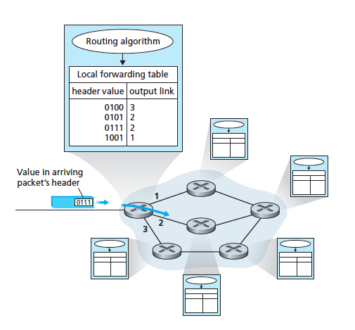
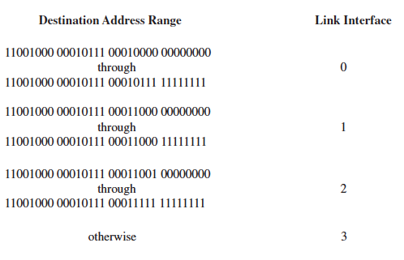
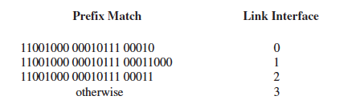

# CH4 Network Layer

* [ x ] Overview and services it provides

* [ x ] Structuring network layer packet delivery:
	* [ x ] Datagram 
	* [ x ] Virtual circuit model

* [ ] Fundamental role that addressing plays in delivering a packet to its destination host

* [ ] Packet forwarding on the internet 

* [ ] IP 

Network-layer addressing and IPv4 datagram format

* [ ] Network address translation (NAT), datagram fragmentation, Internet Control Message Protocol, IPv6

Three major sections:
1. Network layer functions and services
2. Forwarding
3. Routing 

## Overview

The main role of the network layer is to move packets from a sending host to a receiving host.

To do so, 3 important network layer functions are used:

* Forwarding 
* Routing

### Fowarding

* A router-local action 
* When a packet arrives at a router's input link, the router must move the packet to the appropriate output link i.e. the next router which is on a path to the destination host
* Each router has a forwarding table
* A router forwards a packet by examining the arriving packet's header (usually the destination address of the packet) and then inserting that value as the key and the value as the output link the packet will be forwarded to 

### Routing 

* A network wide process 
* Determines end-to-end paths that packets take from source to destination 
* The routing algorithm determines the values that are inserted into the routers' forwarding tables
* May be centralised (operating from one site and then downloading routing info to each of the routers)
* Or decentralised (a piece of the distributed routing algorithm runs in each router)
* Either way, routers receive routing protocol messages which are used to confgure the forwarding table

### Switches

A `packet switch` means a general packet-switching device that transfers a packet from the input link to the output link according to the value in packet's header field 

* Some packet switches are called `link-layer-switches` which base their forwarding decision a link layer field (layer 2)
* Another type of packet switch is a `router` which bases its forwarding decision on the value in the network layer field (layer 3)

### Connection setup

* In some networks, connection setup is required similarly to TCP in which routers along a chosen path from src to dest must handshake with each other to setup state before network layer data packets can be sent 

### Services offered by the network layer

The `network service model` defines the services offered by the network layer to provide end-to-end transport to packets between two end systems 

The Internet's network layers provides a single service known as `best-effort service` where

* Timing between packest is not guaranteed to be preserved
* Packet receipt order not guaranteed
* Eventual delivery of packet not guaranteed

Alternatives do exist to this best-effort model for example ATM service models 

### Virtual circuit and datagram networks

* Similarly to TCP and UDP in the transport layer, the network layer also provides connectionless or connection service between 2 hosts
* `Virtual circuit networks`  provide a connection oriented service
* `Datagram network` provide a connectionless service 
* These two types use very different info in making their forwarding decisions

#### Virtual circuit networks

* The internet uses VC services to implement a connection based service at the network layer 
* Short are called VCs
 
A VC consists of

1. A path of links and routers between src and dest hosts
2. VC numbers, 1 number for each link along the path
3. Entries in the forwarding table in each router along the path

* A packet belonging to a VC will carry a VC number in its header
* Since a VC may contain a different VC number for each link, at each router, the router must update the VC number of the traversing packet with a new number that is obtained from the forwarding table 

##### Main phases

There are three key phases in a virtual circuit:

###### VC setup

* The sending transport layer contacts the network layer, specifies the receiver's address
* The network layer determines the path between sender and receiver and the VC number for each link along the path
* The network layer then adds an entry in the forwarding table in each router along the path 

###### Data transfer

* Once the VC has been established, packets can begin to flow along the VC

###### VC teardown

* Initiated when the sender or receiver informs the network that it wants to terminate the VC 
* The network layer then informs the other end system of the connection that termination has been called at the other end
* Then the network layer updates the forwarding tables in each of the routers along the path (removing relevant entries) to indicate the VC doesn't exist anymore 

Messages that are passed between routers to setup the VC are known as `signaling messages` and the protols used to exchange them are called `signaling protocols`

#### Datagram networks

* In a datagram network, each time a packet is sent, the packet is stamped with the address of the destination and popped onto the network
* No VC setup and routers don't maintain any VC state information 
* At each router the packet travels through from src to dest the router uses the packet's dest address to forward the packet
* The router does this by looking up the dest address on its forwarding table to get back an appropriate output link inferface to send it to and then forwards the packet using this info 

##### How destination address lookup works at each router

* Suppose all dest addresses are 32 bits 
* Each router has four links numbered 0 - 3 
* Then the forwarding table would capture a range to map where addresses in that range should be sent to what output link like so:

The range is condensed into a prefix match such that the table looks like (looks more simple):

* When the address matches more than one entry in the table the router uses the `longest prefix matching rule` in which it matches the address with the longest prefix match in the table 

##### Comparison with VC networks

* Although datagram networks maintain no connection state info they still maintain forwarding state info in their forwarding tables 
* However forwarding tables are constantly modified by routing algorithms at any time not just at connection setup and teardown like in VCs so a series of packets can follow different paths through the network as forwarding tables are modified 
* This results in packets arriving out or order

#### Origins of VC and datagram networks

* VCs evolved from the original telphone networks which used real circuits
* The internet is a datagram network which grew out of the need to connect computers together in a minimal service model - it is much simpler than VCs but provides less services as a result 
* Instead these services are implemented at the higher transport layer e.g. in order delivery, reliable data transfer etc 

### What's inside a router

*  Recall that the forwarding function is the actual transfer of packets from a router's incoming links to the appropriate outgoing links at that router
*  As mentioned above we looked at two aspects of forwarding - addressing and longest prefix matching 
* Note that `forwarding` and `switching` are used interchangeably 

#### Key components

* There are four key components in a router

##### Input ports 

* Terminates an incoming physical link at a router
* Link layer functions to interoperate with the link layer at incoming link 
* The lookup function for the forwarding table is also performed at the input port  which determines which outgoing port the packet should go to
* Control packets containing routing protocol info are forwarded to the routing proccessor 
* Note that `port` refers to the physical input and output interface on the router itself

##### Switching fabric 

* Connects the router's input ports to its output ports
* Completely contained within the router - a network inside of the router!

##### Output ports

* Stores packets received from teh switching fabric and transmits these packets to the outgoing link by performing the necessary link-layer and physical layer functions

##### Routing processor

* Executes routing protocols
* Maintains routing tables and attached link info
* Computes the forwarding table for the router

A router's input ports, output ports and switching fabric implement the forwarding function and are always implemented in hardware

They're collectively referred to a the `router forwarding plane`

`TODO`

* [ ] Cover more infor about this Page 321 - 331 (actual textbook pages, diff from pdf pages)

