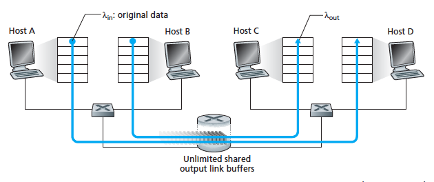
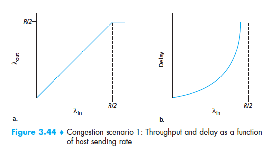
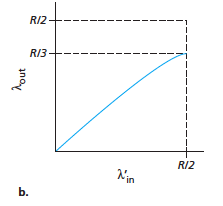
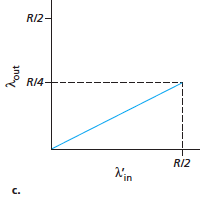
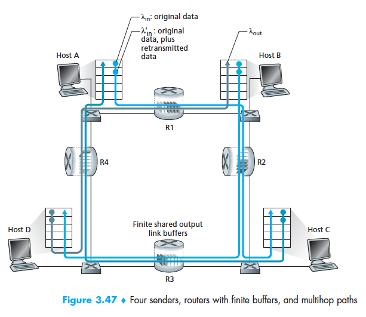
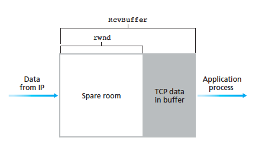

# CH3: Transport Layer

## 3.6 Principles of Congestion Control

* Packet loss is caused byt he overflowing of router buffers as the network becomes congested
* Packet retransmission addresses the issue of packet loss which is a symptom of network congestion but does actually address the cause of congestion i.e. too many sources sending data at too high a rate
* To address the cause, we need to setup mechanisms to throttle senders when congestion occurs

Some important questions: 

* Why is congestion a bad thing?
* How network congestion affects performance in upper-layer applications (end systems)?
* What are the various approaches that can be taken to avoid and respond to network congestion?

### Causes and costs of congestion

Look at three case scenarios in which congestion occurs and examine:

* why congestion occurred in the first place 
* cost of congestion (i.e. resources not fully utilised & poor performane at end systems)

#### Scenario 1: Two senders, a router with infinite buffers

Simplest congestion scenario:

* Two hosts (A and B) each have a connection that shares a single hop between source and destination as shown in the diagram:

* Host A is sending data into the connection at a rate of $$$\lambda_{in}$$$ bytes/sec using a very simply data protocol in which each unit of data is sent only once into the connection, there is no error recovery (e.g. retransmission), flow control or congestion control performed
* Host B operates similarly, also sending at a rate of $$$\lambda_{in}$$$ bytes/sec
* Packets from A and B pass through the same router and over a shared outgoing link of capacity R
* The router has buffers that allow it to store incoming packets when the packet arrival rate exceeds the outgoing link's capacity
* In this scenario assume the router has infinite buffer space
* The following figure plots the performance of Host A's connection under this first scenario. 
* The left graph plots the `per-connection throughput` (bytes/sec at receiver) as a function of the connection sending rate

* For a sending rate between 0 and R/2, the throughput at the receiver equals the sender's sending rate, i.e. everything sent is received at the receiver (no drops) with a finite delay 
* However if the sending rate is **above** R/2 then the throughput is only R/2 since A is sharing the link capacity with B
* While a per-connection throughput of R/2 appears to be a good thing (since the link capacity is fully utilised) 
* The right hand graph plot seen above shows that as the sending rate approaches R/2 the average delay increases!
* When the sending rate exceeds R/2 the average number of queued packets in the router becomes unbounded 
* Hence the average delay between src and dest becomes infinite 
* Hence when link capacity is almost reached queueing delays occur 

#### Scenario 2: Two senders and a router with finite buffers 

Now, slightly modify scenario 1 in two ways:
* Now the amount of router buffer space is finite - as a result packets will be dropped when arriving to an already full buffer
* Assume each connection is reliable but if a packet is dropped then it will be retransmitted by the sender

Hence now we must be careful of the term 'sending rate' since now it includes retransmitted data as well as original data. 

* Denote this rate $$$\lambda'_{in}$$$ bytes/sec which is called the **offered load* to the network
* Performance is now strong influenced by retransmission protocol
* If Host A was to be able to magically determine when a buffer is free in the router and only send when it is free then no loss would occur and hence $$$\lambda_{in} = \lambda'{in}$$$ 
* However this is not possible and realistically the sender will retransmit when a timeout occurs at the sender (ie loss event)

Consider the case where the offered load is equal to R/2 that is takes up the maximum amount on the link before it impacts on thoroughput
* In this case as can be seen in the plot below it can be seen that only R/3 of the data has been delivered at the destination

* Hence we see that retransmissions are necessary to compensate for dropped packets due to buffer overflow which is caused by congestion

Now consider the case where the sender may time out prematurely and retransmit a packet that has been delayed in the queue but not yet lost:

* If the timeout value is large enough it is possible to guarantee that a packet that hasn't been acknowledged has been definitely lost but this impacts thoroughput and hence isn't realistic to set
* Hence this is another cost of congestion - multiple duplicate retransmissions waste link bandwidth  further causing congestion 
* The result on the per connection thoroughput can be seen below if the sender sends on average two copies of each packet:

#### Scenario 3: Four Senders, Routers with Finite Buffers, and Multihop Paths

Now there are:

* Four hosts transmitting packets over overlapping two hop paths
* Timeout/retransmission mechanisms are in place for reliable data transfer

First consider the case of extremely low traffic

* For extremely small values of $$$\lambda_{in}$$$ buffer overflows are rare however the throughput will be equal to the offered load

Now consider the case of high traffic:

* Where the value of $$$\lambda_{in}$$$ is extremely large and hence $$$\lambda'{in}$$$ also is extremely large:
* Recall no matter how large $$$\lambda_{in}$$$ is it can only have an arrival rate at the router at most R (the capacity of the link)

Consider the connection A-C and B-D in the diagram above:

* Both paths must travel through router R2
* If the arrival rate of A-C traffic at R2 is large and the arrival rate of B-D at R2 is larger then A-C and B-D traffic must compete at R2 for a limited amount of buffer space
* Hence A-C traffic that successfully pass through R2 and is not lost due to buffer overflow will become smaller as the offered load from B-D gets larger
* This limit of heavy traffic gradually decreases the throughput of the A-C connection to zero 

#### Costs of congestion

A summary of the points from the scenario. When network congestion occurs:

* and link capacity is almost reached queueing delays occur 
* retransmissions are necessary to compensate for dropped packets due to buffer overflow 
* multiple duplicate retransmissions waste link bandwidth further causing congestion 
* when a packet gets dropped along a path, it's like a domino waste effect in which all the transmission capacity of the upstream links that were used to forward that packet to that point is wasted

### Approaches to congestion control

#### End-to-end congestion control

* The network layer provides no explicit support to the transport layer for congestion control
* Presence of congestion in the network must be therefore, inferred
* TCP infers this by necessity using timeout or triple duplicate ACKs and decreases window size accordingly

#### Network-assisted congestion control

* Network layer componets (i.e. routers) provide explicit feedback to the sender about the congestion state in the network
* This could be as simple as setting a single bit indicating congestion or setting explicit rate to send at 

#### Example uses

* Used in ATM available bit-rate (ABR) congestion control
* XCP protocol also does this by providing router-computed feedback to the sender consisting of a packet header which indicates whether trnasmission rate should be increased/decreased

##### Two congestion notification types

* A `choke packet` is sent from the router to the sender which says basically "I'm congested!"
* Update a field in a packet flowing from sender to receiver to indicate congestion which the receiver then sends back to sender. This takes at least one rtt.

## 3.7 TCP Congestion Control

* Uses `end-to-end congestion control` (rather than `network-assisted`) since the IP layer does not provide any data to end systems about network congestion

### How it works 

* Each sender limits the rate at which it sends traffic into its connection as a function of perceived network congestion 
* I.e. if a TCP sender perceives there is little congestion on the path between itself and the destination, the sender increases its send rate, othwerise the sender reduces its send rate

#### How does a TCP sender limit the rate at which it sends traffic into the connection?

* The TCP connection keeps track of a **congestion window** denoted `cwnd` in its header 
* `cwnd` stores the max rate at which a a TCP sender can send traffic into the network

Recall:
* `rwnd` stores the receive window which is the amount of spare room in the buffer
* `rwnd = RcvBuffer - [LastByteRcvd - LastByteRead]`

* Hence the amount of unacknowledged data at sender may not exceed the minimum of `cwnd` and `rwnd`
* I.e. `LastByteSent - LastByteAcked <= min(cwnd, rwnd)`
* This constraint limits the amount of unacknowledged data which indirectly limits the sender's send rate
* To understand how this works consider a connection in which loss and packet transmission delays are negligble - then at the beginning of every RTT, the sender is permitted to send `cwnd` bytes and at the end of of the RTT the sender receives acknowledments for the data making the sender's rate roughly `cwnd/RTT bytes/sec`.

#### How does a TCP sender perceive congestion along the path to the destination?

A "loss event" at a TCP sender is defined as:

* the event of a timeout
* receipt of 3 duplicate ACKs from the receiver

Hence when there is excessive congestion, packets are dropped which leads to a loss event at the sender which indicates congestion on the sender-to-receiver path.

However when the network is congestion free, loss events don't occurr and ACKs arrive on time before timeout - this indicates to the sender that the path is congestion free and hence the sender will increase its congestion window size (and hences its transmission rate).

* If acknowledgements arrive at a relatively slow rate (e.g. on a path that has high delay or low bandwidth link) then `cwnd` will oonly be increased at a relatively slow rate
* Otherwise if acknowledgments are arrived at a high rate than `cwnd` will be increased more quickly
* TCP uses acknowledgements to trigger/clock its increase in `cwnd` it's said to be `self-clocking`

#### What algorithm does the sender use to change its send rate based on perceived end-to-end congestion?

* A lost segment implies congestion and hence the sender's rate should be decreased when a segment is lost (i.e timeout or four ACKs - 1 original and three duplicate)
* An acknowledged segment indicates that the network is delivering the sender's segments successfully and the sender's rate can be increased 
* Bandwidth probing - Increase send rate when ACKs arrive and decrease when a loss event occurs 

